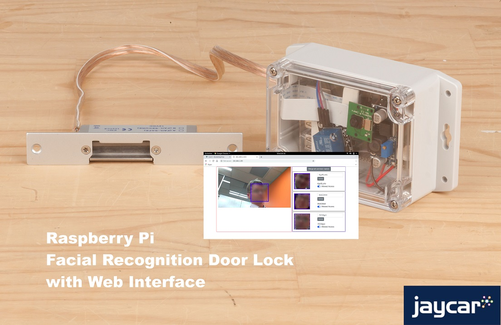
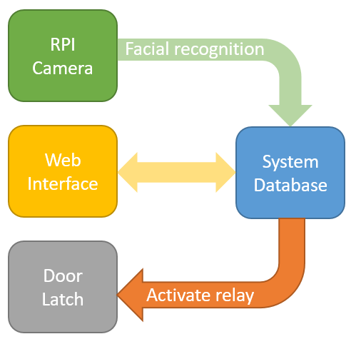

# Facial-Recognition-Door-Lock

Want to see who's trying to enter your room? Or do you want simple key-less entry into your work shed? This project makes it easy using the raspberry pi camera and relay to door-strike to perform a simple locking mechanism.



This project provides a network web-interface so you can check up on your raspberry pi camera. Every time the raspberry pi sees a new face, it will save it onto a database and allow you to _Allow_ or _Disallow_ those people from entering your room.

If it sees a face that you have _allowed_, it will activate the door-strike so you can open the door.

- [Facial-Recognition-Door-Lock](#Facial-Recognition-Door-Lock)
  - [Bill of Materials](#Bill-of-Materials)
    - [You might also need](#You-might-also-need)
    - [Have you considered?](#Have-you-considered)
  - [System Overview](#System-Overview)
  - [Connection diagrams](#Connection-diagrams)
  - [Programming](#Programming)
    - [Source code discussion](#Source-code-discussion)
  - [Assembly Instructions](#Assembly-Instructions)
    - [Cut acrylic](#Cut-acrylic)
    - [Prepare regulator (optional)](#Prepare-regulator-optional)
    - [Mounting](#Mounting)
      - [Terminal block.](#Terminal-block)
  - [Use](#Use)
  - [Explore](#Explore)
    - [Future improvements and good first issues.](#Future-improvements-and-good-first-issues)

## Bill of Materials

| Qty   | Code                                     | Description                            |
| ----- | ---------------------------------------- | -------------------------------------- |
| 1     | [XC9001](http://jaycar.com.au/p/XC9001)  | Raspberry Pi 3B+                       |
| 1     | [XC9020](http://jaycar.com.au/p/XC9020)  | Raspberry Pi Camera                    |
| 1     | [LA5077](http://jaycar.com.au/p/LA5077)  | Narrow Fail-Safe Door Strike           |
| 1     | [WC6026](http://jaycar.com.au/p/WC6026)  | Cables                                 |
| 1     | [XC4514](http://jaycar.com.au/p/XC4514)  | Power supply module                    |
| 1     | [XC4419](http://jaycar.com.au/p/XC4419)  | Relay board                            |
| 1     | [PT3002](http://jaycar.com.au/p/PT3002)  | 4 way Terminal block                   |
| 1     | [HB6251](http://jaycar.com.au/p/HB6251)  | Waterproof enclosure                   |
| 1 (+) | [HM9509](https://jaycar.com.au/p/HM9509) | Acryllic sheet (plus spares if needed) |

In this project, we are using the [XC4514](https://jaycar.com.au/p/XC4514) with a 12v power supply to provide power to both the door strike and the raspberry pi.

### You might also need

- RPi power supply, such as [MP3536](https://jaycar.com.au/p/MP3536).
- 12v power source, to activate the door strike.

### Have you considered?

- [XC9021](https://jaycar.com.au/p/XC9021) Night vision camera for the Raspberry Pi
- [WC7756](https://jaycar.com.au/p/WC7756) micro USB extension lead, which can make for easier powering of the Raspberry Pi.

## System Overview



The idea is simple; the RPI camera looks out infront of the door lock and runs a program to recognise faces. Once a face is detected, it will then generate an `ID` for that face, and check if it is in the database.

- if the face ID is in the database, and it's allowed, it activates the relay (and unlocks the door)
- if the face is in the database, and it's not allowed, it keeps the door shut.
- if the face is not in the database, it adds it to the database and keeps the door shut.

When we access the web interface, it can show us a list of faces that have been detected and have a switch so we can allow / disallow each one. (faces have been blurred below for privacy, but the blurring does not happen on the unit.)


The code is cobbled together with python but if you're good at making web interfaces (using vue.js) then we'd love some contributions to make the interface better.

## Connection diagrams

The general schematic to the design is below. This design uses the [XC4514](https://jaycar.com.au/p/XC4514) to power the rpi off the same power supply as the relay / door strike. We also use a 4 terminal block to make mounting and connecting cables a bit easier.


To control the relay, we use the RPi Camera running facial recognition code, from the `face_recognition` library by [@ageitgeu](https://github.com/ageitgey/face_recognition) and our additions below.

## Programming

We've set up a startup script to make it easier to install this software but it is still under a bit of development. Try it out and let us know of any problems via the issues tab on the github repo.

Once you have booted into linux on your raspberry pi, you can type the below commands to download this repository and run the setup script:

```bash
git clone https://github.com/Jaycar-Electronics/Facial-Recognition-Door-Lock
cd Facial-Recognition-Door-Lock
./setup.sh
```

This should set everything up for you and reboot the pi when it is finished.

While it's running, feel free to go through the [Assembly Instructions](#Assembly-Instructions) and build the rest of the housing before placing the rpi in.

Note: **Make sure to jot down the IP address through the `ifconfig` command.** There is no screen once it is all mounted, so we will have to remote into the device to make changes. if you want to use something such as "http://camera.local" as your network address, have a look at [mDNS]().

### Source code discussion

The code itself is easy enough to follow and has 3 main parts:

- `doorlock.py`
  - This is the script that pulls it all together and creates a webserver that you can issue commands to/from.
- `functions.py`
  - is the script which outlines the functions for access granted, denied, and contains the main camera/detect loop. This is the script that contains the GPIO controlling code.
- `identifier.py`
  - This is the python object that manages the user identities, such as who is allowed in and what they look like

We've commented the code as much as possible, so check out the scripts and get a feel for what's happening if you want to modify any of the program.

## Assembly Instructions

We've tried to make this a little easier without having to buy a tonne of screws and to make it fairly waterproof, but there's always room for improvement; feel free to experiment with mounting and let us know how it turns out! We can update the project with recommended changes.

The following is just a guide on one possible way to mount it. For our purposes though, these work well enough.

### Cut acrylic

The width of the [HB6251](https://jaycar.com.au/p/HB6251) is 80mm wide, so we're aiming to cut an acrylic panel at least 80mm wide so that it can snuggle into the case.

Start by marking a line straight across one of the edges of the acrylic, 80mm in from the edge using a pencil.


In the photo above we are using a smaller piece, but the idea is the same. You need to use a ruler to ensure that the line is straight, and _"score"_ it with a knife ( multiple shallow cuts to break the surface). It works better if you score both sides of the acrylic, so make sure that you make it straight and accurate.

Score both sides, then use force to push down, with the edge of a table or bench right on the line of split.


With a bit of force, the acrylic should eventually snap into a very clean sharp line. If not, then it's possible that it was not _scored_ enough or the force was a bit too un-even. It can take a few tries to get right so get a few spare [HM9509](https://jaycar.com.au/p/HM9509).

### Prepare regulator (optional)

The regulator is adjustable, so we must adjust it to work at the 5.1v required by the Raspberry Pi.

Previously we have thought to use socket connections to connect straight into the `5V` pins on the raspberry Pi, however in hindsight this could lead to problems and instead, we'd recommend soldering on a micro-USB connector ( slice up an old cable or use [WC7756](https://jaycar.com.au/p/WC7756)).

Keep in mind that this section is completely optional. It could be better to just tap out the 5V connection to the outside of the case, using the [WC7756](https://jaycar.com.au/p/WC7756), and drilling a hole to hot-glue the end of the cable so that it is connectable from the outside. This might mean that people can pull out the power supply however.

Connect up the regulator and adjust it to 5V - 5.1V before you connect it to anything on the raspberry Pi.


The regulator does a great job of providing the current and stable voltage that we need.

### Mounting

Here we just used our double-sided tape to position the regulator, relay, and camera onto the acrylic base. You could use screws and nylon washers here to make a bit more of a professional mount / display.


In the picture above, we didn't attach the camera. That will go on last once it is plugged into the RPi.

Also remember that we are using a USB plug to power the device. If the wires to your plug is a bit flimsy, you can lock them down with either zip-ties (and drill-holes near the cable) or some hot-glue to do the trick.

#### Terminal block.

The terminals are easy to place. Simply drill 4 holes in the housing to line up with each of the terminals. If you want to make the entire assembly a tad more waterproof, you can drill them underneath the unit for when you mount it to the wall, which will cover up the holes to protect from splashing. See the below picture for guidance.


Remember that one Red/Black pair will be the power in, and the other will be output for the latch. You should mark this on the unit once you have mounted the terminal block (either by glue or screws) so that you do not get confused later on, otherwise the device will not turn on.


You should put this terminal block to the side so that you have enough room in the unit for the pi to fit in, around the USB cable.

When connecting the terminals, keep in mind that there's two ways that you can connect the terminals,
depending on what you want.

We've labelled them as _general_ and _active_ - which changes how the connection to the door strike is working. If you want the system to be completely 5V ( as so there is no 12V inside the case, and you are not using the regulator) then you can go with the general case, so that the terminals (A and B) will be shorted once the signal comes from the software ( via connecting A/B to the relay COM/NC).

Otherwise, you can connect it as shown in the _12V active_ which means that terminals A/B will act as a power supply; providing 12V when a signal comes from the software.

Either way is possible; it's just a case of how you want to set up the door strike with it's own power supply or using the power supply connected to the raspberry PI.


Once that has been done, you can connect it all up and press the acrylic sheet in. You should find that the acrylic is fairly tight but not impossible fit against the walls of the container. Once the relay and required components are in, the pi should power up just fine. You can run some test code to see if the relay functions before putting it in as wel.


Once it is in, test it out and tighten the screws so it remains water-proof.

## Use

Here is a screenshot of the device in use. Once it is hooked up to the network, find the device IP through your router settings or otherwise and open the page on a web-browser such as chrome.


Here it will generate a thumbnail of each face that it has found and has memory of, as well as the current live feed. you can delete users and deny access. You can access the webpage by going to the ip-address of the raspberry PI. If you also enable `ssh` access you can connect to it wirelessly and configure it from within.

## Explore

There is a wide variety of what you can do with this project; for instance, if you want to connect a speaker system to it, you can use something like [PyMedia](http://pymedia.org/) to play audio such as a voice prompt to say "access denied."

the file `functions.py` has the `accessDenied` and `accessGranted` functions that define what happens when the user is denied or granted access, in our code you can see that it turns the relay on and off.

### Future improvements and good first issues.

Below is a list of items we'd like to see in the project, but haven't had time to implement ourselves. If you want to work on these issues below, click on the related issue number and comment anything you might have issues with, we're happy to help you as much as possible.

| Issue ID                                                                            | Description                                                                                                                     | Difficulty   |
| ----------------------------------------------------------------------------------- | ------------------------------------------------------------------------------------------------------------------------------- | ------------ |
| [#4 ](https://github.com/Jaycar-Electronics/Facial-Recognition-Door-Lock/issues/4)  | Run faster with better async / code layout                                                                                      | Intermediate |
| [#5 ](https://github.com/Jaycar-Electronics/Facial-Recognition-Door-Lock/issues/5)  | Better User Interface with vuetify                                                                                              | Beginner     |
| [#6 ](https://github.com/Jaycar-Electronics/Facial-Recognition-Door-Lock/issues/6)  | Change the `Sanic` library to something more supported                                                                          | Beginner     |
| [#7 ](https://github.com/Jaycar-Electronics/Facial-Recognition-Door-Lock/issues/7)  | build a Python 3.7 installer and convert project to python 3.7                                                                  | Beginner     |
| [#8 ](https://github.com/Jaycar-Electronics/Facial-Recognition-Door-Lock/issues/8)  | Set friendly names for user IDs                                                                                                 | Beginner     |
| [#9 ](https://github.com/Jaycar-Electronics/Facial-Recognition-Door-Lock/issues/9)  | Client should see new user ids as they are scanned                                                                              | Intermediate |
| [#10](https://github.com/Jaycar-Electronics/Facial-Recognition-Door-Lock/issues/10) | Show the name on the screen when the face is detected                                                                           | Beginner     |
| [#11](https://github.com/Jaycar-Electronics/Facial-Recognition-Door-Lock/issues/11) | Improve the stream on the web interface (hint look at our [pan-tilt camera](https://www.jaycar.com.au/pan-tilt-camera) project) | Intermediate |
| [#12](https://github.com/Jaycar-Electronics/Facial-Recognition-Door-Lock/issues/12) | Improve the speed of the `face_recognition` library. dlib is too slow.                                                          | Advanced     |
| [#13](https://github.com/Jaycar-Electronics/Facial-Recognition-Door-Lock/issues/13) | Merge username / IDs                                                                                                            | Intermediate |
